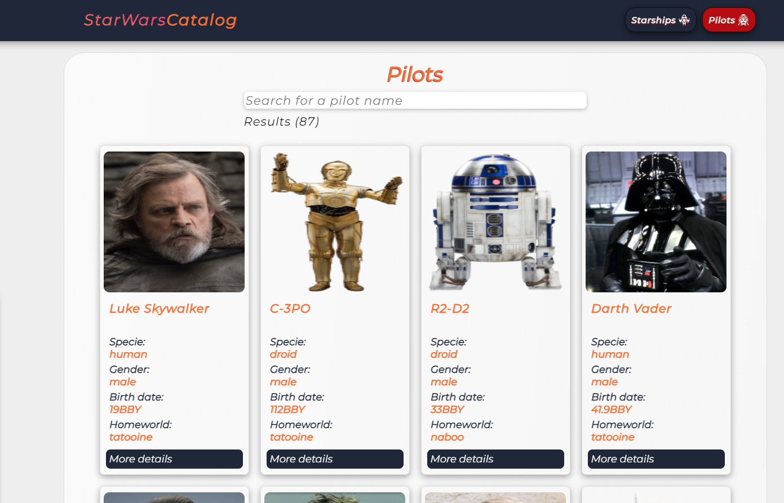

# teste-processo-seletivo-certi
# Sobre o Projeto

- [Tecnologias Utilizadas](#tecnologias-utilizadas)
- [Instruções para rodar o projeto](#instruções-para-rodar-o-projeto)
- [Telas](#telas)

Teste de desenvolvimento de catalago de pilotos e espaço naves do star wars para processo seletivo CERTI.
Optei por utilizar a lib reactJS por acreditar ser a mais adequada em termos de performance para o tipo da tarefa designada. E também porque tenho familiriadade com ela.
No Backend optei por gerar um fake database acoplado ao frontend, que pode ser encontrado em src/services/database. A api utilizada para gerar esse fakedatabase pode ser encontrada [aqui](https://github.com/Lmsilvano/teste-processoseletivo-certi-backend).

#### [Link do deploy do projeto na netlify](https://starwarscatalog-certi.netlify.app)
### Telas
# Tecnologias utilizadas:
* Javascript com **React**
* CSS-in-JS (Styled Components)
* HTML
* NodeJS
### ReactJS, Recursos utilizados:
##### Hooks
State, Effect
##### React Router ^6.3.2
UseParams, BrowserRouter, Routes, Route, Link, NavLink.
##### Axios ^0.24.0
Request(Get)

# Instruções para rodar o projeto.
- Basta clonar, ou fazer donwload deste repositório;
 
- e com o [Node](https://nodejs.org/en/) devidamente instalado em sua maquina;
 
- Abra o terminal de sua prefência no diretório raiz deste projeto(o diretório raiz é onde se encontra o arquivo package.json). 
dica :(no windows basta segurar a tecla shift e clicar no fundo da pasta raiz do projeto com o botão direito do mouse e selecionar "abrir janela do powershellaqui") 

- com terminal aberto no diretório raiz do projeto, execute o comando "npm install -y".

- Após concluir a instalação, mantendo-se no diretório raiz do projeto, execute o comando "npm start"
- você também pode conferir o projeto rodando [aqui](https://starwarscatalog-certi.netlify.app)
[pookie](#pookie)

## Telas

### Pilots

### Starships
---

### Pilots Details
---

